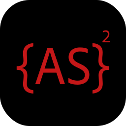

<p align="center"></p>
<p align="center"></p>
<h3 align="center">Showcase your skills on your GitHub or resumé with ease!</h3>
<hr>

<h3 align="center">Powered by Cloudflare Workers ⚡</h3>

<h3>NOTE: To keep icons consistent and to ensure browser support, we don't accept pull requests for icon submissions. If you would like an icon added, please open an issue.<h3>

# Docs

- [Example](#example)
- [Specifying Icons](#specifying-icons)
- [Themed Icons](#themed-icons)
- [Icons Per Line](#icons-per-line)
- [Centering Icons](#centering-icons)
- [Icons List](#icons-list)

# Example

<p align="center"></p>
<p align="center"></p>

# Specifying Icons

Copy and paste the code block below into your readme to add the skills icon element!

Change the `?i=js,html,css` to a list of your skills seprated by ","s! You can find a full list of icons [here](#icons-list).

```md
[](https://skillicons.dev)
```

[
# Themed Icons

Some icons have a dark and light themed background. You can specify which theme you want as a url parameter.

This is optional. The default theme is dark.

Change the `&theme=light` to either `dark` or `light`. The theme is the background color, so light theme has a white icon background, and dark has a black-ish.

**Light Theme Example:**

```md
[](https://skillicons.dev)
```

[](https://skillicons.dev)

# Icons Per Line

You can specify how many icons you would like per line! It's an optional argument, and the default is 15.

Change the `&perline=3` to any number between 1 and 50.

```md
[](https://skillicons.dev)
```

[]([https://ikyih.github.io/more-spsific-skill-icons]

# Centering Icons

Want to center the icons in your readme? The SVGs are automatically resized, so you can do it the same way you'd normally center an image.

```html
<p align="center">
  <a href="https://skillicons.dev">
    
  </a>
</p>
```

<p align="center">
  <a href="https://skillicons.dev">
    
  </a>
</p>

# Icons List

Here's a list of all the icons currently supported.

|      Icon ID       |                         Icon                          |
| :----------------: | :---------------------------------------------------: |
|     `AS2`      |        |
|   `AS3`    |    |
|      `Sketch`       |          |

---

